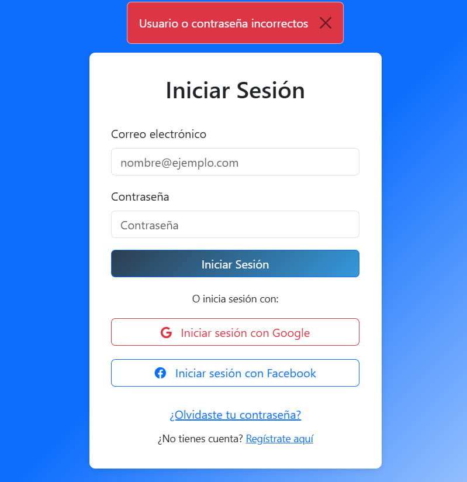

# rental-system---backend
Este es un proyecto para realizar un breve CRUD de clientes y productos de un sistema de contratación de instructores fitness
# Screenshot



### Installation

```bash
git clone https://github.com/EstebanCabreraArbizu/rental-system---backend.git
cd rental-system---backend
pip install -r requirements.txt
python -m app.main
```

### issues
- sudo apt-get install libmysqlclient-dev